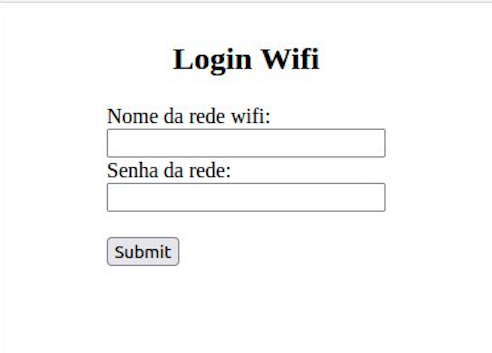

# Gateway

Componente de Gateway do Strongberry, responsável pela comunicação entre o sistema embarcado e as APIs. O Gateway foi desenvolvido para ser executado em uma ESP 32 LoRa que deve ser localizada perto da área de trabalho do veículo.

## Pré-requisitos

É necessário ter uma placa ESP 32 conectada no computador via cabo USB para conseguir executar o programa.

### Ambiente de desenvolvimento da ESP 32

O sistema utiliza do ambiente de desenvolvimento da ESP 32, que deve ser instalado no computador.

Utilize do comando abaixo para fazer a instalação no Linux Ubuntu ou Debian.

```sh
sudo apt-get install git wget flex bison gperf python3 python3-pip python3-setuptools cmake ninja-build ccache libffi-dev libssl-dev dfu-util libusb-1.0-0
```

Para a instalação em outros sistemas operacionais, veja os links abaixo:
* [Linux](https://docs.espressif.com/projects/esp-idf/en/latest/esp32/get-started/linux-setup.html)
* [Windows](https://docs.espressif.com/projects/esp-idf/en/latest/esp32/get-started/windows-setup.html)
* [MacOS](https://docs.espressif.com/projects/esp-idf/en/latest/esp32/get-started/macos-setup.html)

### ESP-IDF

O projeto utiliza da biblioteca ESP-IDF da Espressif, para instala-la é necessário baixar o repositório com os seguintes comandos:

```sh
mkdir -p ~/esp
cd ~/esp
git clone --recursive https://github.com/espressif/esp-idf.git
```

Dessa forma a ESP-IDF será salva em `~/esp/esp-idf` e para instalar, é necessário entrar na pasta e executar o script de instalação. Veja os comandos abaixo:

```sh
cd ~/esp/esp-idf
./install.sh esp32
```

Com a biblioteca instalada, execute o comando abaixo dentro da pasta do projeto para incluir as variáveis no PATH:

```sh
. $HOME/esp/esp-idf/export.sh
```

## Configuração

Use o comando abaixo para configurar o projeto para ser utilizado na ESP-32.

```sh
idf.py set-target esp32
```

*OBS.: Esse comando só é necessário na primeira vez que o projeto for executado.*

### Variáveis de Ambiente

Ajuste as variáveis de ambiente utilizando da interface de configuração da Espressif. Rode o comando abaixo para acessar a interface:

```sh
idf.py menuconfig
```

Acesse a opção de `StrongBerry Configuration` e lá coloque as variáveis das rotas das APIs de Veículos (`Vehicle API Route`) e Dados dos Sensores (`Sensors Data API Route`) que serão utilizadas. Caso esteja rodando no seu computador, utilize o seu IP e as portas de cada serviço.

O código de fabricação do veículo também é configurado nesse menu, para altera-lo acesse a variável `Code`. Para desenvolvimento essa variável é atribuida inicialmente como `XLR8`.

## Como rodar

Com o ambiente configurado, rode o gateway seguindo os passos a baixo:

**PASSO 1 -** Crie no sistema um veículo com o código do veículo fornecidos nas variáveis do Gateway. Caso não tenha sido alterado, o código é `XLR8`.

**PASSO 2 -** Conecte a ESP 32 no computador

**PASSO 3 -** Rode o comando abaixo para gravar o firmware na placa e monitorar o terminal
```sh
idf.py -p [PORT] flash monitor
```
Troque `[PORT]` pela porta onde a ESP 32 está conectada no seu computador. Veja abaixo o padrão de portas para cada sistema:

- Linux - `/dev/tty`;
- Windows - `COM1`;
- MacOS - `/dev/cu`

exemplo: `idf.py -p /dev/ttyUSB0 flash monitor`

**PASSO 4 -** Ligue a ESP 32

**PASSO 5 -** Por outro dispositivo acesse o sinal de WiFi StrongBerry que será emitido pela placa.

**PASSO 6 -** Nesse dipositivo conectado à rede do Gateway acesse o endereço `192.168.4.1` via browser, esse endereço dará acesso a uma página como a da imagem abaixo. Forneça os dados de nome da rede e senha do WiFi local e clique em *submit*. Isso permitirá com que o Gateway se conecte a Internet.



Após todos os passos de configuração o Gateway estará conectado as APIs e estará pronto para enviar e receber os dados.

## Referencias
[Espressif - ESP32 - Get Started](https://docs.espressif.com/projects/esp-idf/en/latest/esp32/get-started/index.html#get-started-connect)

